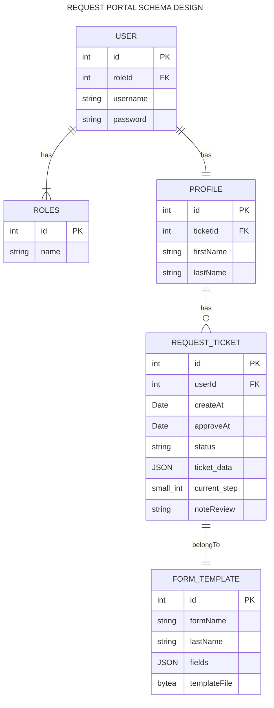

```mermaid
---
   title: REQUEST PORTAL SCHEMA DESIGN 
---
erDiagram
    USER {
        int id PK
        int roleId FK
        string username
        string password
    }

    ROLES {
        int id PK
        string name
    }

    PROFILE {
        int id PK
        int ticketId FK
        string firstName
        string lastName
    }

    REQUEST_TICKET {
        int id PK
        int userId FK
        Date createAt 
        Date approveAt 
        string status
        JSON ticket_data
        small_int current_step
        string noteReview
    }
    
    FORM_TEMPLATE {
        int id PK
        string formName
        string lastName
        JSON fields
        bytea templateFile
    }

    USER || -- || PROFILE : has
    REQUEST_TICKET || -- || FORM_TEMPLATE : belongTo
    PROFILE || -- o{ REQUEST_TICKET : has
    USER || -- |{ ROLES : has
```
